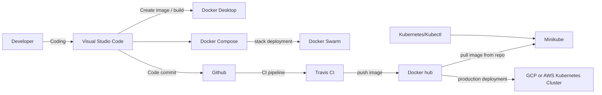

# Docker Notes
These notes are based on the LinkedIn course -  Docker for developers by Emmanuel Henri - [Docker for developers (linkedin.com)](https://www.linkedin.com/learning/docker-for-developers-14493163/docker-for-developers?autoplay=true&resume=false)

---
## Need for Docker
- Docker is needed in the scenarios where you need to setup new projects with the same settings and configuration across different servers, desktops.
- Docker provides container where all the project specific settings, its inversion of control and the resources required for the code to run are packaged within the container.
- A Container is the location where all the resources required by the application exists. 
- The container itself is immutable and is static therefore it requires volume to store the data. It is external disk to which the data is stored. This is required in case of running database as containers that can then store the data on external volumes.
- In addition, container by itself has no idea about the external environment and the networking. therefore for the container to talk to external environment you will need to configure the networking to enable it to talk to one-another.

## Core Components of Container based Development

##  Tools Utilized in Docker based Development

## Step 1: Docker Desktop Installation on Windows
- when installing docker desktop, download the docker for windows.
- This might require installation of an older version of WSL to run it on the desktop. This is done from Microsoft website.
	- WSL stands for windows subsystem for Linux. Using this you are able to run a Linux environment in windows.
	- [Manual installation steps for older versions of WSL | Microsoft Docs](https://docs.microsoft.com/en-us/windows/wsl/install-manual#step-4---download-the-linux-kernel-update-package)

The commands for docker are available at [[Docker-Commands]]

Once docker desktop is installed a simple docker based POC conducted can be performed following steps mentioned in [[Simple Docker Project]]

---
- These notes are based on my understanding of the topic. Some of the content and images refers to the online articles, learning courses I attended. I encourage you to lookup the links provided to develop your own understanding of it at deeper level.
- The intention of these notes is to serve as reference marker to other sites, online courses, books that I found useful while learning about it.
- If you would like to share any thoughts or give comments please feel free to reach me @ abhishekgupta86@gmail.com or @ www.linkedin.com/in/abhishekgupta86
---

