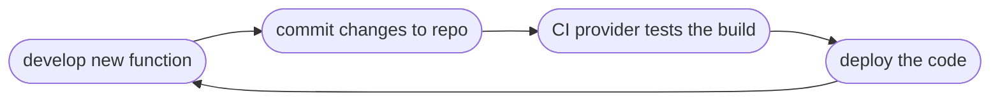

# Travis based Continuous Integration
These notes are based on the LinkedIn course -  Docker for developers by Emmanuel Henri - [Docker for developers (linkedin.com)](https://www.linkedin.com/learning/docker-for-developers-14493163/docker-for-developers?autoplay=true&resume=false)

---
- Travis CI is a cloud based managed service that can be used for integrating it with a GitHub repos to continuously build and compile the repo.
- Similar to Travis there are many other CI platforms that can be used to achieve the same objective. example - Circle CI, Azure CI etc.
- Travis is a ruby based CI platform that gets triggered based on the ==.travis.yml== file that must be present at the root of the project folder that you need to build
	- To check for the file that has been used for this POC refer the code repository at Github - [abhishekgupta-myrepo/travis-ci_poc (github.com)](https://github.com/abhishekgupta-myrepo/travis-ci_poc)
- Travis platform gets trigged based on everytime a commit happens to the repository that has been configured with Travis for build.
- In order to use Travis you will need to create an account with Travis and will have to specify the repo in github that you would like to be configured.

## Process for Continuous Integration

- Docker fits well into this process where each time the build is triggered in Tavis it can compile and then create the docker image that can be pushed onto a remote repo. [Using Docker in Builds - Travis CI (travis-ci.com)](https://docs.travis-ci.com/user/docker/)

- You can view the history of the build as well as view the current build that is in process. Travis provides you with console where you can view the logs as the build is in progress.

- The same ==.travis.yml== can the be used to push the image that has been created into the remote repo such as docker hub.

- At the end of this CI pipeline a CD (Continuous Deployment) platform can then take up the image pushed into the remote repo to update the Kubernetes cluster based environment running.

---
- These notes are based on my understanding of the topic. Some of the content and images refers to the online articles, learning courses I attended. I encourage you to lookup the links provided to develop your own understanding of it at deeper level.
- The intention of these notes is to serve as reference marker to other sites, online courses, books that I found useful while learning about it.
- If you would like to share any thoughts or give comments please feel free to reach me @ abhishekgupta86@gmail.com or @ www.linkedin.com/in/abhishekgupta86
---

