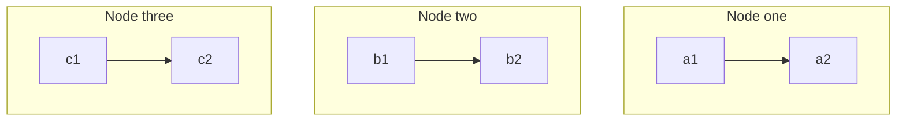

# Introduction to Swarm
Instructions below are based on following the directions provided during the course :  Docker for developers by Emmanuel Henri - [Docker for developers (linkedin.com)](https://www.linkedin.com/learning/docker-for-developers-14493163/docker-for-developers?autoplay=true&resume=false)

---
- Docker Swarm is a tool to manage cluster of nodes. Each node runs multiple containers. A node is a physical or a virtual machine on which multiple containers are run.
- The swarm then provides the ability to load balance the nodes and manage multiple nodes within the clusters.


- Docker swarm works on the principle of master and slave model. The master node has the swarm that manages the worked nodes on which the containers are deployed.
- On a local machine you can setup a single node swarm where the same node can be used for running the containers and the swarm to manage it.
- On the servers each node that needs to be joined with the master must be joined and must have the docker installed. Once it is joined to the ==master node Swarm== it then takes care of deploying the containers on the nodes.
- Docker swarm comes installed with docker desktop. 
Follow the below commands to run the docker swarm locally. This requires the == docker compose .yml== file that you can refer from the GitHub project @  - [abhishekgupta-myrepo/docker_poc (github.com)](https://github.com/abhishekgupta-myrepo/docker_poc)
-  **Step 1** : Run the below command in PowerShell from Visual Studio code 
```bash
PS C:\Users\abhis\Projects\docker_poc> docker swarm init
Swarm initialized: current node (82w06t5v7kdki2pncbb93ivvy) is now a manager.

To add a worker to this swarm, run the following command:

    docker swarm join --token SWMTKN-1-4mou11qdvv4zggmgdhrtq33kmphvhrxtqe0pqq99ow9foxbyp5-e7868tp81uaun9qtkcrel1n6h 192.168.65.3:2377

To add a manager to this swarm, run 'docker swarm join-token manager' and follow the instructions.
```

- ==You need to ssh into the machine that you want to add to the swarm where you need to run the command==
```bash
docker swarm join --token SWMTKN-1-4mou11qdvv4zggmgdhrtq33kmphvhrxtqe0pqq99ow9foxbyp5-e7868tp81uaun9qtkcrel1n6h 192.168.65.3:2377
```
- **Step 2** : Check for the  information about the docker setup that will also provide details about the docker swam that has been initialized.
```bash 
PS C:\Users\abhis\Projects\docker_poc> docker info
Client:
 Context:    default
 Debug Mode: false
 Plugins:
  buildx: Docker Buildx (Docker Inc., v0.9.1)
  compose: Docker Compose (Docker Inc., v2.10.2)
  extension: Manages Docker extensions (Docker Inc., v0.2.9)
  sbom: View the packaged-based Software Bill Of Materials (SBOM) for an image (Anchore Inc., 0.6.0)
  scan: Docker Scan (Docker Inc., v0.19.0)

Server:
 Containers: 0
  Running: 0
  Paused: 0
  Stopped: 0
 Images: 0
 Server Version: 20.10.17
 Storage Driver: overlay2
  Backing Filesystem: extfs
  Supports d_type: true
  Native Overlay Diff: true
  userxattr: false
 Logging Driver: json-file
 Cgroup Driver: cgroupfs
 Cgroup Version: 1
 Plugins:
  Volume: local
  Network: bridge host ipvlan macvlan null overlay
  Log: awslogs fluentd gcplogs gelf journald json-file local logentries splunk syslog
 Swarm: active
  NodeID: 82w06t5v7kdki2pncbb93ivvy
  Is Manager: true
  ClusterID: wd8zdd14dyeflloa4jzdpdaoo
  Managers: 1
  Nodes: 1
  Default Address Pool: 10.0.0.0/8
  SubnetSize: 24
  Data Path Port: 4789
  Orchestration:
   Task History Retention Limit: 5
  Raft:
   Snapshot Interval: 10000
   Number of Old Snapshots to Retain: 0
   Heartbeat Tick: 1
   Election Tick: 10
  Dispatcher:
   Heartbeat Period: 5 seconds
  CA Configuration:
   Expiry Duration: 3 months
   Force Rotate: 0
  Autolock Managers: false
  Root Rotation In Progress: false
  Node Address: 192.168.65.3
  Manager Addresses:
   192.168.65.3:2377
 Runtimes: io.containerd.runc.v2 io.containerd.runtime.v1.linux runc
 Default Runtime: runc
 Init Binary: docker-init
 containerd version: 9cd3357b7fd7218e4aec3eae239db1f68a5a6ec6
 runc version: v1.1.4-0-g5fd4c4d
 init version: de40ad0
 Security Options:
  seccomp
   Profile: default
 No Proxy: hubproxy.docker.internal
 Registry: https://index.docker.io/v1/
 Labels:
 Experimental: false
 Insecure Registries:
  hubproxy.docker.internal:5000
  127.0.0.0/8
 Live Restore Enabled: false
```
- **Step 3** : Look at the node that has been created - 
```bash
PS C:\Users\abhis\Projects\docker_poc> docker node ls
ID                            HOSTNAME         STATUS    AVAILABILITY   MANAGER STATUS   ENGINE VERSION
82w06t5v7kdki2pncbb93ivvy *   docker-desktop   Ready     Active         Leader           20.10.17
PS C:\Users\abhis\Projects\docker_poc> 
```
- **Step 4** : Run the below command to deploy the stack on docker swarm.
	- For this command to run make sure that the image name is mentioned in the docker-compose file and the version of the ==docker-compose.yml is 3.0==
```bash
PS C:\Users\abhis\Projects\docker_poc> docker stack deploy -c docker-compose.yml STACK
Ignoring unsupported options: build, links, restart

Ignoring deprecated options:

container_name: Setting the container name is not supported.

expose: Exposing ports is unnecessary - services on the same network can access each other's containers on any port.

Updating service STACK_client (id: jaojw6zb20dihl7wgwkweu79c)
image clientapp:latest could not be accessed on a registry to record
its digest. Each node will access clientapp:latest independently,
possibly leading to different nodes running different
versions of the image.

Creating service STACK_app
Creating service STACK_mongo
PS C:\Users\abhis\Projects\docker_poc> 
```
- **Step 5** : Validate that the docker containers are up and running. 
	- If you check all the containers will be instantiated as part of the stack that you described in the docker compose .yml and will be prefixed with the name that you provided to the stack at the time of ==docker stack deploy== command
```bash
PS C:\Users\abhis\Projects\docker_poc> docker service ls
ID             NAME           MODE         REPLICAS   IMAGE               PORTS
303uyn5tfhsg   STACK_app      replicated   1/1        backendapp:latest   *:4000->4000/tcp
jaojw6zb20di   STACK_client   replicated   1/1        clientapp:latest    *:3000->3000/tcp
nujukyytj1jl   STACK_mongo    replicated   1/1        mongo:latest        *:27017->27017/tcp
PS C:\Users\abhis\Projects\docker_poc> 
```
- **Step 6** : Stop the docker swarm based services using the command below - 
	- Stopping the stack service is important else it will keep running.
```bash
-PS C:\Users\abhis\Projects\docker_poc> docker stack rm STACK
Removing service STACK_app
Removing service STACK_client
Removing service STACK_mongo
Removing network STACK_default
```

 To develop a CI pipeline from Github project using Travis CI app refer to the notes on [[CI with Travis]]
	- This takes it to full circle where once the code is developed, tested locally, and committed to the git repo in Github a continuous integration tool such as Travis can be used for continuous build that gets triggered for each commit to compile the code and push the image into a remote repository such as docker hub.


---
- These notes are based on my understanding of the topic. Some of the content and images refers to the online articles, learning courses I attended. I encourage you to lookup the links provided to develop your own understanding of it at deeper level.
- The intention of these notes is to serve as reference marker to other sites, online courses, books that I found useful while learning about it.
- If you would like to share any thoughts or give comments please feel free to reach me @ abhishekgupta86@gmail.com or @ www.linkedin.com/in/abhishekgupta86
---

