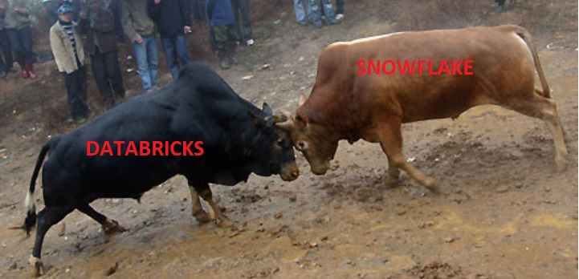

# Snowflake Vs. Databricks

Created: 2022-06-28 09:47:11 -0400

Modified: 2022-06-29 07:54:58 -0400

---

<table>
<colgroup>
<col style="width: 22%" />
<col style="width: 39%" />
<col style="width: 37%" />
</colgroup>
<thead>
<tr class="header">
<th><strong>Feature</strong></th>
<th><strong>Databricks</strong></th>
<th><strong>Snowflake</strong></th>
</tr>
</thead>
<tbody>
<tr class="odd">
<td><strong>Founders</strong></td>
<td><ul class="incremental">
<li>
Ex-Berkley, Authors of Spark. Donated Spark to Apache and then opened managed services company as Databricks.
</li>
<li>
Planned for IPO in 2022
</li>
</ul></td>
<td><ul class="incremental">
<li>
Ex-Oracle, Oracle principles behind the snowflake architecture
</li>
<li>
Public listed. Revenue $1.2B
</li>
</ul></td>
</tr>
<tr class="even">
<td><strong>Architecture</strong></td>
<td>Big data distributed computing provided spark as a managed service.</td>
<td>SaaS Datawarehouse platform. Truly separates storage from compute.</td>
</tr>
<tr class="odd">
<td><strong>Implementation Cloud</strong></td>
<td>Tight with Azure but also available on GCP, AWS</td>
<td>Tight with AWS but also available on GCP, Azure</td>
</tr>
<tr class="even">
<td><strong>Machine Learning</strong></td>
<td><ul class="incremental">
<li>
ML Lib library. Native to the Spark distribution.
</li>
<li>
ML Core is the core library that does internal management, scheduling, memory management.
</li>
<li>
Jupyter Notebook style environment to perform the ML experiments.
</li>
</ul>
<blockquote>

</blockquote></td>
<td><ul class="incremental">
<li>
Provides machine learning capability through newly launched feature Snowpark.
</li>
<li>
It is Snowflake + Spark providing connectors through java, scala, python api.
</li>
<li>
It requires the data to be available in the snowflake. Else you need to load the data from lake into snowflake.
</li>
<li>
Partner ecosystem that integrates with snowflake.
</li>
</ul></td>
</tr>
<tr class="odd">
<td><strong>Data Ingestion</strong></td>
<td><ul class="incremental">
<li>
ML Streams. Part of the Spark core distribution.
</li>
<li>
Provides both real-time events and batch ELT processing.
</li>
<li>
Loads the data from various data sources including data lake.
</li>
</ul></td>
<td><ul class="incremental">
<li>
Uses partner network to provide the ingestion.
</li>
<li>
Databricks is also a partner of snowflake
</li>
<li>
Has developed snowpipe for short batch mode data ingestion
</li>
</ul></td>
</tr>
<tr class="even">
<td><strong>Use cases</strong></td>
<td><ul class="incremental">
<li>
Focused on Machine learning use cases
</li>
<li>
Big data processing
</li>
</ul></td>
<td><ul class="incremental">
<li>
Focused on data warehousing use cases
</li>
<li>
Developing dashboards on top of processed data from snowflake
</li>
</ul></td>
</tr>
<tr class="odd">
<td><strong>Pricing</strong></td>
<td><ul class="incremental">
<li>
Pay as you go pricing. You pay for the databricks and the underlying resources such as the compute and storage used in the cloud
</li>
</ul></td>
<td><ul class="incremental">
<li>
Pay as you go. You pay for the storage of the data and the compute. This is in form a warehouse servers which can be spin up to perform the compute.
</li>
</ul></td>
</tr>
<tr class="even">
<td><strong>Scalability</strong></td>
<td><ul class="incremental">
<li>
Clusters can be scaled with 100's of spark executor nodes added to the cluster to perform the compute.
</li>
<li>
Clusters can be spin on for each job to be executed and then shut down the job completes.
</li>
<li>
Cluster can also be spin up for performing ML development
</li>
<li>
Has auto scaling mode.
</li>
</ul></td>
<td><ul class="incremental">
<li>
Warehouse machines are small, medium, large, X Large. Each has defined number of nodes that can be increased or decreased in auto-scaling mode.
</li>
</ul></td>
</tr>
<tr class="odd">
<td><strong>Users</strong></td>
<td><ul class="incremental">
<li>
Data Engineers, Data Scientist, Advanced Data analysts
</li>
</ul></td>
<td><ul class="incremental">
<li>
Data analysts, business users, Data engineers
</li>
</ul></td>
</tr>
<tr class="even">
<td><strong>Coding languages</strong></td>
<td><ul class="incremental">
<li>
Java, Scala (Major), Pyspark(Major), C, Hive SQL
</li>
</ul></td>
<td><ul class="incremental">
<li>
ANSI SQL, Python (Snowpark. New feature), Scala (Snowpark. New feature)
</li>
</ul></td>
</tr>
</tbody>
</table>

